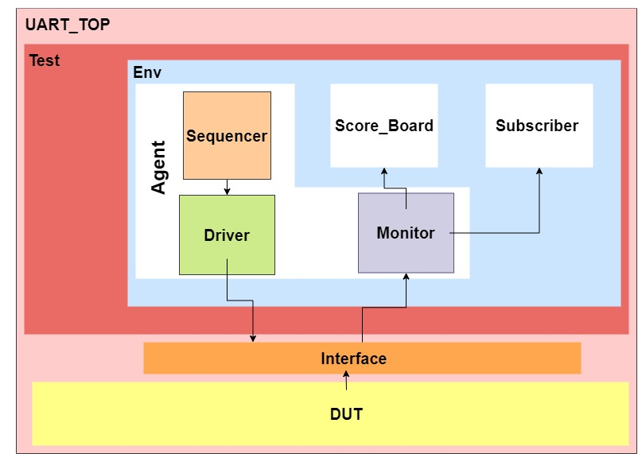

# UART_RX_UVM
Acrross this project ,I developedmy own verification plan many times  on other hand i applied common Verification Methodology UVM with verification techniques like code , functional coverage in addition to assertions.

## Verification Env Used
 *UVM Hierarchy*
