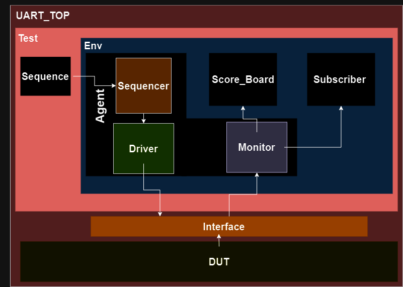
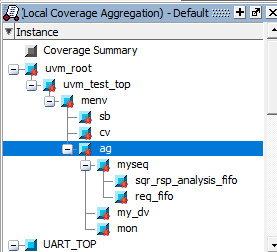
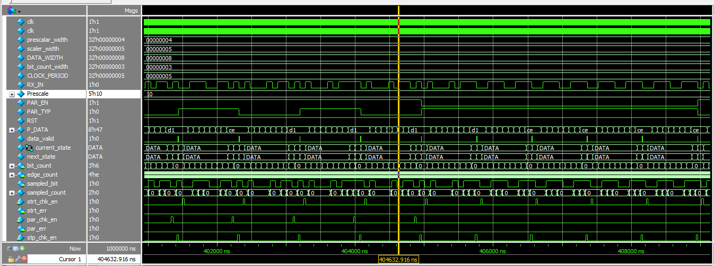
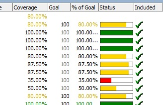
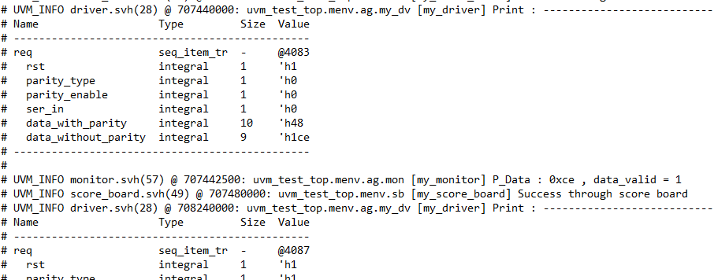
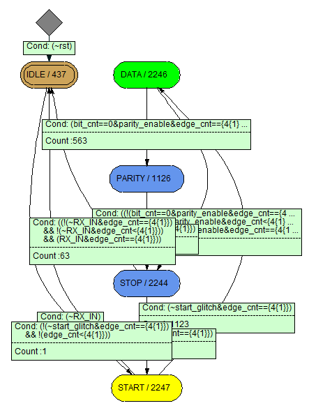

# UART_RX_UVM
Across this project, I developed my own verification plan many times  on the other hand I applied common Verification Methodology UVM with verification techniques like code, and functional coverage in addition to assertions.

## Verification Env Used
 *UVM Hierarchy*

## UVM Hierarchy
 *UVM Hierarchy*

## Wave Form
 *Wave Form*

## Coverage analysis 
 *coverage*

## Log 
 *transcript*

## FSM 
 *FSM*
